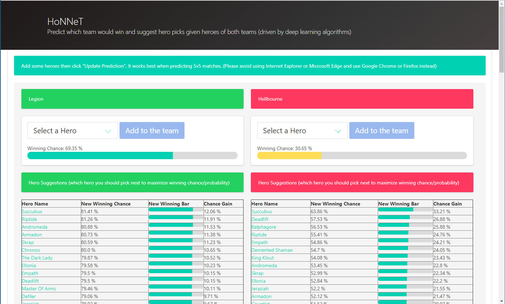

# HoNNeT
Deep learning predicts who would win in a HoN match given heroes of both team.

The idea is that we will download match information in the past and train a deep learning model
which receives hero picks of both team as input then predict which team is winning.

**Note**: Heroes of Newerth (HoN) is a multiplayer online battle arena (MOBA) game similar to DOTA
but is very popular among Thai people.

## Role of each file
- `hon_db_retriever.ipynb` contains data preparation/wrangling process, this is
  probably the most time consuming part of the pipeline, it downloads HoN
  matches and save it into a **pickle** file. The data retrieval part is based on
  international HoN's API which is very limited in number of matches you can download per API call.
- `hon_matches.pkl` contains downloaded 100,000 matches
- `hon_db_analyzer.ipynb` contains deep learning part and data
  exploration/visualization
- `honnet_loader.ipynb` loads the trained model and save it for later use in
  multiple formats
- Other files are explained at
  the [web repository](https://github.com/off99555/HoNNeT-web) because they are
  the same.

## Disclaimer
The data used for training the model needs to be updated regularly because heroes mechanisms are updated often.
Look at the modification date of the `honnet_brain.h5` to see when it was last updated.

**PS.** This repository is for gathering matches data and training deep learning model only.
For the user interface which is implemented as a web application on Heroku, you need to see
[HoNNeT-web](https://github.com/off99555/HoNNeT-web) repository.
